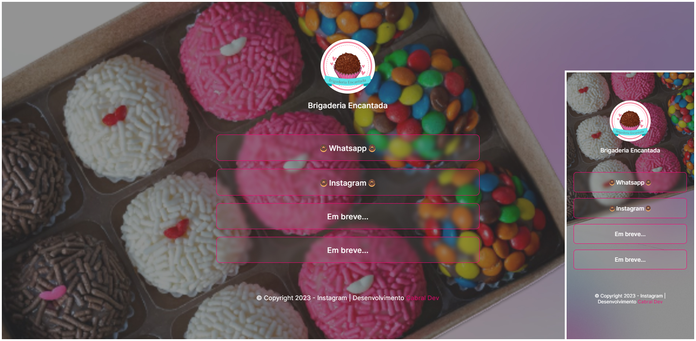

<h1 align = "center">Projeto Brigaderia Encantada</h1>

  

## 🚀 Tecnologias

Esse projeto foi desenvolvido com as seguintes tecnologias:

- HTML e CSS
- JavaScript
- Git e Github
- Figma

## 💻 Projeto

Brigaderia Encantada é uma empresa que fabrica brigadeiros por encomendas, e foi solicitado um site para bio no qual os clientes conseguissem ter acessos a diversos conteúdos da empresa.

Feito por Cabral Dev - Guilherme Cabral